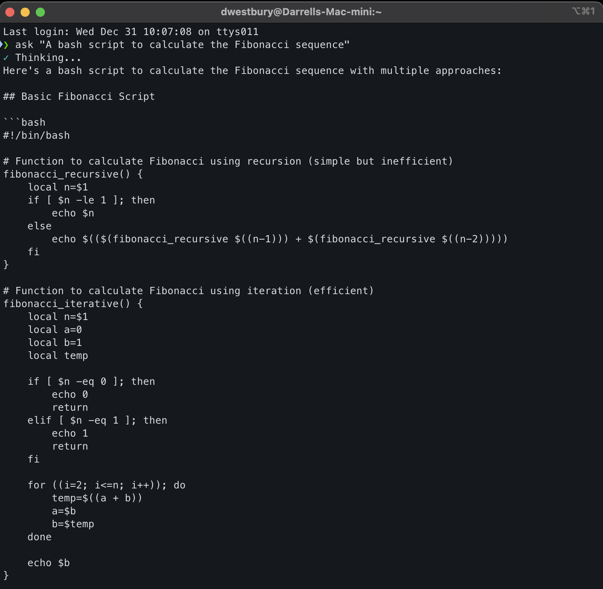

# ask - Claude AI Command-Line Tool



A simple, fast command-line tool to interact with Claude AI directly from your terminal.

## Features

- **Web Search Integration**: Claude can search the web for current information when needed
- **Session-Based Conversations**: Maintain conversation context across multiple queries
- **Quick one-shot questions** to Claude
- **Pipe command output** for analysis
- **Beautiful terminal output** with colors, formatting, and emojis
- **Smart tool usage**: Claude intelligently decides when web search adds value
- **Configurable**: Control tools, domain filtering, and session behavior
- Shows a spinner during API calls (like docker-compose)
- Works on macOS (Apple Silicon), Intel-based RHEL, and AMD-based Ubuntu
- Secure API key management via `.env` files

## Requirements

- Python 3.10 or higher
- Anthropic API key ([get one here](https://console.anthropic.com/settings/keys))

## Installation

### 1. Clone or download this repository

```bash
cd /path/to/ask-claude
```

### 2. Install the package

```bash
pip install .
```

This will install the `ask` command to your Python environment's bin directory, which should be in your PATH.

### 3. Set up your API key

Create a `.env` file in one of these locations:

**Option A: Global configuration (recommended)**
```bash
mkdir -p ~/.config/ask
echo "ANTHROPIC_API_KEY=your-key-here" > ~/.config/ask/.env
```

**Option B: Project-specific configuration**
```bash
echo "ANTHROPIC_API_KEY=your-key-here" > .env
```

Replace `your-key-here` with your actual Anthropic API key from https://console.anthropic.com/settings/keys

### 4. (Optional) Install to /usr/local/bin

If you want the command available system-wide without activating a Python environment:

```bash
# After pip install, find where the script was installed
which ask

# Create a symlink (adjust the source path based on your system)
sudo ln -sf $(which ask) /usr/local/bin/ask
```

## Usage

### Direct questions

```bash
ask "what day of the week is it today?"
```

### Pipe input for analysis

```bash
cat docker-compose.yml | ask "How many containers are in this application and what do you think it does?"
```

```bash
ls -la | ask "what files are taking up the most space?"
```

```bash
git diff | ask "summarize these changes"
```

### Combine piped input with a question

```bash
docker ps | ask "are any of these containers unhealthy?"
```

### Web search for current information

Claude automatically searches the web when you ask about current events, recent data, or time-sensitive information:

```bash
ask "What were the major tech announcements at CES 2026?"
```

```bash
ask "What's the latest version of Python and what are its new features?"
```

```bash
ask "Current weather in San Francisco"
```

For general knowledge questions, Claude responds directly without web search:

```bash
ask "What is Docker?"  # No web search needed
```

### Session-based conversations

Enable conversation persistence within a terminal session:

```bash
# Set a session ID to maintain context across queries
export ASK_SESSION_ID=$(uuidgen)

# First query
ask "What is Kubernetes?"

# Follow-up query - Claude remembers the previous conversation
ask "How does it compare to Docker Swarm?"

# Another follow-up
ask "Which one should I choose for a small team?"
```

Without `ASK_SESSION_ID`, each query is independent (backward compatible).

## How It Works

The tool:
1. Reads your Anthropic API key from a `.env` file
2. Loads configuration (tools, session settings, etc.)
3. Accepts input from command-line arguments and/or stdin (pipes)
4. Manages conversation sessions (if `ASK_SESSION_ID` is set)
5. Sends your question to Claude AI (using the `claude-sonnet-4-20250514` model)
6. Claude intelligently decides whether to use web search based on your query
7. Displays a spinner while waiting for the response
8. Renders Claude's answer with rich terminal formatting (colors, emojis, and markdown)
9. Saves conversation history to session (if applicable)

## Advanced Configuration

You can customize the tool's behavior using environment variables in your `.env` file:

### Tool Configuration

```bash
# Enable/disable all tools (default: true)
ASK_ENABLE_TOOLS=true

# Enable/disable web search specifically (default: true)
ASK_ENABLE_WEB_SEARCH=true

# Maximum number of web searches per query (default: 5)
ASK_WEB_SEARCH_MAX_USES=5
```

### Domain Filtering

Control which domains Claude can search (use only one):

```bash
# Only allow specific domains
ASK_ALLOWED_DOMAINS=wikipedia.org,github.com,stackoverflow.com

# OR block specific domains
ASK_BLOCKED_DOMAINS=example.com,spam-site.com
```

### Model Configuration

```bash
# Change the Claude model (default: claude-sonnet-4-20250514)
ASK_MODEL=claude-sonnet-4-20250514

# Adjust maximum response tokens (default: 4096)
ASK_MAX_TOKENS=4096
```

### Session Management

```bash
# Session timeout in hours (default: 24)
ASK_SESSION_TIMEOUT_HOURS=24

# Enable session persistence in your shell (add to ~/.bashrc or ~/.zshrc)
export ASK_SESSION_ID=$(uuidgen)
```

### Disable Tools for Simple Queries

If you want the old behavior (no web search, faster responses for simple questions):

```bash
ASK_ENABLE_TOOLS=false ask "What is Python?"
```

## Platform Compatibility

Tested and working on:
- ✅ macOS (Apple Silicon)
- ✅ Intel-based RHEL
- ✅ AMD-based Ubuntu

## Troubleshooting

### "ANTHROPIC_API_KEY environment variable is not set"

Make sure you've created a `.env` file in either:
- `~/.config/ask/.env` (global)
- Current directory (project-specific)

### "command not found: ask"

Make sure the Python bin directory is in your PATH, or follow the optional step to symlink to `/usr/local/bin`.

### Dependencies not installing

Make sure you have Python 3.10 or higher:
```bash
python3 --version
```

## Example .env File

See `example.env` for a complete template with all available options:

```bash
# Required
ANTHROPIC_API_KEY=sk-ant-api03-xxx

# Optional: Model configuration
# ASK_MODEL=claude-sonnet-4-20250514
# ASK_MAX_TOKENS=4096

# Optional: Tool configuration
# ASK_ENABLE_TOOLS=true
# ASK_ENABLE_WEB_SEARCH=true
# ASK_WEB_SEARCH_MAX_USES=5

# Optional: Domain filtering
# ASK_ALLOWED_DOMAINS=wikipedia.org,github.com
# ASK_BLOCKED_DOMAINS=example.com

# Optional: Session management
# ASK_SESSION_TIMEOUT_HOURS=24
```

## Dependencies

- `anthropic` - Official Anthropic Python SDK
- `python-dotenv` - Load environment variables from .env files
- `yaspin` - Terminal spinner for better UX
- `rich` - Beautiful terminal formatting with colors and markdown rendering

## License

This tool is provided as-is for personal and commercial use.
